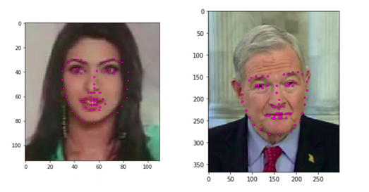
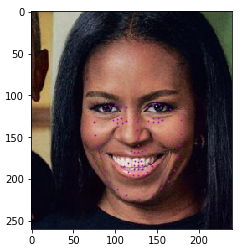

## Project 1: Facial Keypoint Detection

In this project, I combined the knowledge of computer vision techniques and deep learning architectures to build a facial keypoint detection system that takes in any image with faces, and predicts the location of 68 distinguishing keypoints on each face!

the keypoint detection system is based on CNN and trained by pytorch,
The training and validation datasets are images datasets that have been extracted from the YouTube Faces Dataset

#### Some results of the implemented facial keypoint detection system:
Avg. Loss: 0.006979901203885674 after 5 Epochs

