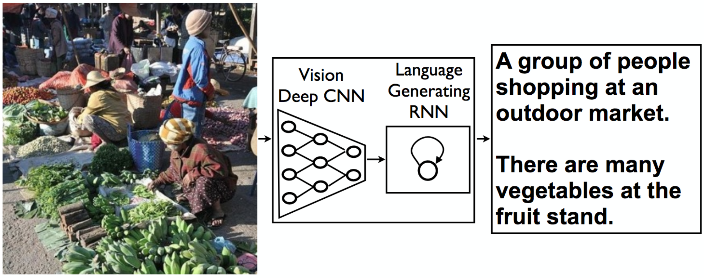

## Project 2: Image Captioning
In this project, I designed a CNN-RNN (Convolutional Neural Network - Recurrent Neural Network) model for automatically generating image captions.

the CNN model is responsible for feature extraction and based on RESNET with adjusting the weights of the final layer only ,
the RNN model is responsible for generating the sequence of the captions and based on LSTM.
#### Some results of the implemented Image caption model:

Av.Loss: 1.9959, Perplexity: 7.35909 after training for 3 epochs , the main target of this project is to proof that the model is able to train and predict acceptable predections. Not to implement the most perfect model, so there are some results that are not accurate enough.
