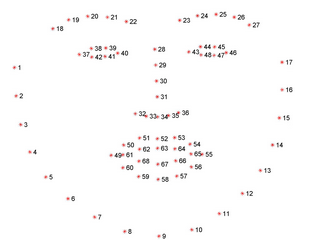
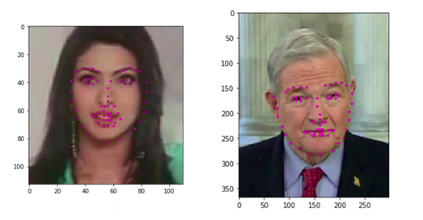
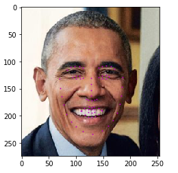
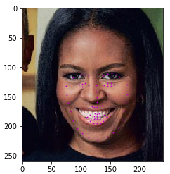
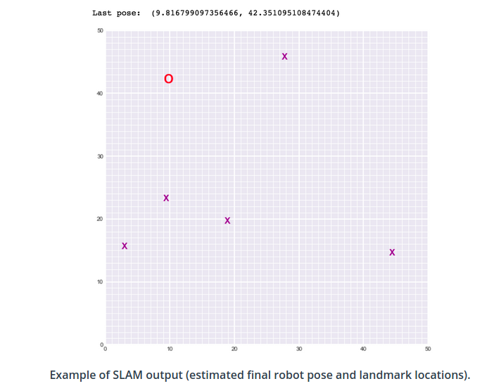

# Computer-Vision-NanoDegree

This repository contains my projects issued for the [Computer Vision Nanodegree ](https://www.udacity.com/course/computer-vision-nanodegree--nd891) at [Udacity](https://Udacity.com).

## Project 1: Facial Keypoint Detection

In this project, I combined the knowledge of computer vision techniques and deep learning architectures to build a facial keypoint detection system that takes in any image with faces, and predicts the location of 68 distinguishing keypoints on each face!

the keypoint detection system is based on CNN and trained by pytorch,
The training and validation datasets are images datasets that have been extracted from the YouTube Faces Dataset

#### Some results of the implemented facial keypoint detection system:
Avg. Loss: 0.006979901203885674 after 5 Epochs

## Project 2: Image Captioning
In this project, I designed a CNN-RNN (Convolutional Neural Network - Recurrent Neural Network) model for automatically generating image captions.

the CNN model is responsible for feature extraction and based on RESNET with adjusting the weights of the final layer only ,
the RNN model is responsible for generating the sequence of the captions and based on LSTM.
#### Some results of the implemented facial keypoint detection system:

Av.Loss: 1.9959, Perplexity: 7.35909 after training for 3 epochs , the main target of this project is to proof that the model is able to train and predict acceptable predections. Not to implement the most perfect model, so there are some results that are not accurate enough.

## Project 3: Landmark Detection
In this project, I implemented SLAM (Simultaneous Localization and Mapping) for a 2 dimensional world!
this was done by combining robot sensor measurements and movement to create a map of an environment from only sensor and motion data gathered by a robot, over time.
 
SLAM enables tracking the location of a robot in the world in real-time and identifying the locations of landmarks such as buildings, trees, rocks, and other world features. This is an active area of research in the fields of robotics and autonomous systems.

